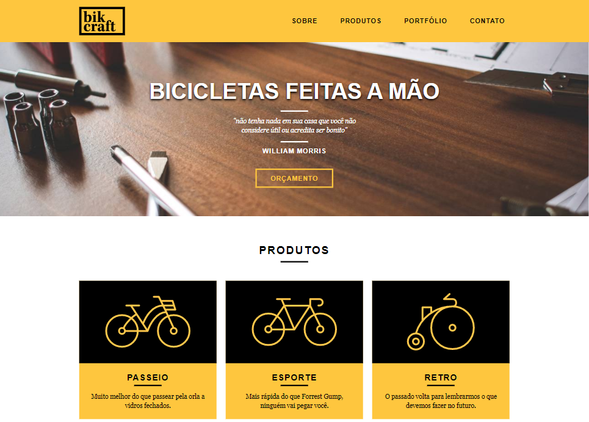

💻 Atualizado em 10 de Maio de 2021 💻

# Projeto Origamid - Web Design Completo

## Objetivo

Ensinar na prática como criar um site responsivo do zero. Do Design ao Código, sem a necessidade de conhecimentos anteriores na área.

## Grade do curso

1. <b>Introdução</b>  
   O curso e a Interface

2. <b>Teoria do Design</b>  
   Fundamentos / UX / UI

3. <b>Design do Projeto</b>  
   AI / Wireframe / Adobe XD / Design Bikcraft

4. <b>Básico de Codificação</b>  
   Código / HTML / CSS

5. <b>Código do Projeto</b>  
   HTML / CSS / Responsividade / JavaScript / Animações / Hospedagem

## Link

https://gabrielcoelhox.github.io/bikcraft/

## 📷 Veja 📷

## Home

## Demonstração Mobile

